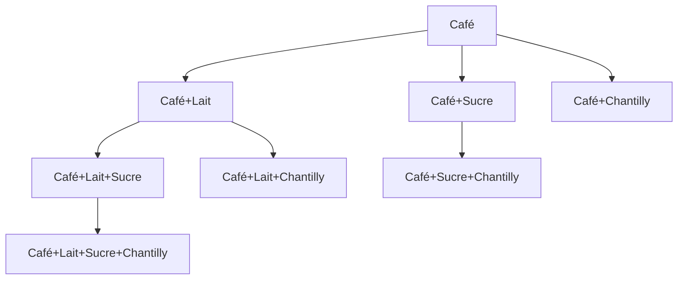
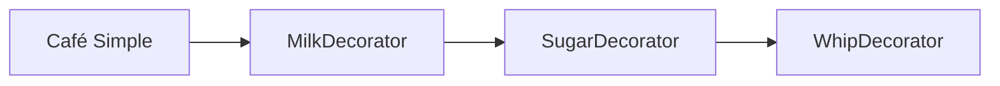

# Decorator Pattern

## ☕ Comment ajouter du lait ET du sucre à un café
## **sans créer 50 classes ?**

<div @click="$slidev.nav.next" class="mt-12 py-1 cursor-pointer" hover:bg="white op-10">
  <carbon:arrow-right /> Commencer
</div>

<style>
h1 {
  background-color: #2B90B6;
  background-image: linear-gradient(45deg, #4EC5D4 10%, #146b8c 20%);
  background-size: 100%;
  -webkit-background-clip: text;
  -moz-background-clip: text;
  -webkit-text-fill-color: transparent;
  -moz-text-fill-color: transparent;
}
</style>

---
transition: slide-up
class: text-center
---

# L'Analogie du Café ☕

<div v-click class="mt-8">
  <CoffeeVisualizer />
</div>

<div v-click class="mt-8 text-xl">
  Chaque décorateur <strong>enveloppe</strong> le précédent<br>
  et ajoute son propre comportement
</div>

---
transition: slide-left
---

# Le Problème : Héritage vs Composition

<div grid="~ cols-2 gap-8" class="mt-4">
<div v-click>

### ❌ Avec Héritage


**Explosion combinatoire !** 💥

</div>
<div v-click>

### ✅ Avec Decorator


**Composition flexible !** ✨

</div>
</div>

<div v-click class="mt-8 text-center text-xl">
  Le Decorator Pattern utilise la <strong>composition</strong>, pas l'héritage
</div>

---
transition: slide-up
layout: center
class: text-center
---

# La Mathématique derrière le Pattern

<div class="text-2xl">

<v-clicks>

<div class="mb-8">

**Fonction de base :**

$$f(x) = \text{Café à } 2€$$

</div>

<div class="mb-8">

**Décorateur Lait :**

$$g(x) = f(x) + 0.50€$$

</div>

<div class="mb-8">

**Décorateur Sucre :**

$$h(x) = g(x) + 0.30€$$

</div>

<div class="text-yellow-400 font-bold">

**Résultat :**

$$h(g(f(x))) = 2.80€$$

</div>

</v-clicks>

</div>

---
transition: slide-left
---

# En Code : Classes qui s'enveloppent

```ts {monaco-run}
// f(x) - Classe de base
class Cafe {
  prix() { return 2 }
  nom() { return "Café" }
}

// g(f(x)) - Décorateur Lait
class Lait {
  constructor(c) { this.c = c }  // c = f(x)
  prix() { return this.c.prix() + 0.5 }  // g(f(x))
  nom() { return this.c.nom() + " + Lait" }
}

// h(g(f(x))) - Décorateur Sucre  
class Sucre {
  constructor(c) { this.c = c }  // c = g(f(x))
  prix() { return this.c.prix() + 0.3 }  // h(g(f(x)))
  nom() { return this.c.nom() + " + Sucre" }
}

// Composition : h(g(f(x)))
let commande = new Cafe()      // f(x)
commande = new Lait(commande)  // g(f(x))
commande = new Sucre(commande) // h(g(f(x)))

console.log(commande.nom() + " = " + commande.prix() + "€")
// "Café + Lait + Sucre = 2.8€"
```

---
transition: fade-out
class: text-center
---

# ✅ Points Clés à Retenir

<div class="grid grid-cols-3 gap-4 mt-12">

<div v-click>

### 🎯 **Principe**
$f(x) \rightarrow g(f(x)) \rightarrow h(g(f(x)))$

</div>

<div v-click>

### 🧱 **Structure**
Composition d'objets : chaque classe enveloppe la précédente

</div>

<div v-click>

### 🔀 **Ordre**
$h \circ g \circ f(x)$ — On peut composer dans n'importe quel ordre

</div>

</div>

<div v-click class="mt-16">

### 💡 Applications Réelles

- **Express.js** : `middleware3(middleware2(middleware1(req)))`
- **Node.js** : `compress(encrypt(readFile()))`
- **React** : `withAuth(withLogger(Component))`

</div>

---
layout: center
class: text-center
---

# Merci ! 🎉

## Questions ?

<div class="mt-8">
  <a href="https://refactoring.guru/design-patterns/decorator" target="_blank" class="text-blue-500 hover:underline">
    En savoir plus sur Refactoring Guru
  </a>
</div>

<style>
.slidev-layout {
  background: linear-gradient(135deg, #1e293b 0%, #0f172a 100%);
  color: white;
}
</style>
